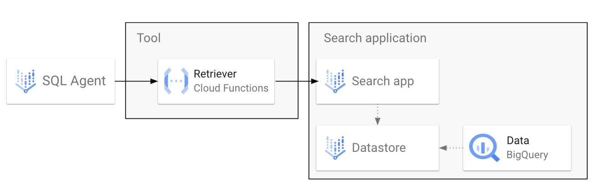
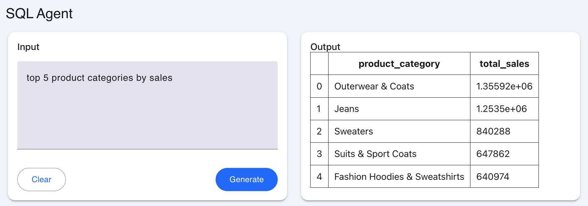

# Agente SQL de BigQuery
Este directorio contiene código de muestra para 1) Conectar un conjunto de datos de BigQuery a Agent Builder como herramienta y también 2) Ejecutar un agente SQL como una aplicación independiente (un agente básico si no necesita ninguna otra funcionalidad adicional).

### OPCIÓN 1: Conectar Agent Builder a un almacén de datos de BigQuery


### OPCIÓN 2: Usar Gemini para convertir el lenguaje natural a SQL y recuperarlo de BigQuery
Con esta opción, que se recomienda para la mayoría de los tipos de datos estructurados, en lugar de tener una aplicación Vertex AI Search, los datos se recuperan a través de una consulta SQL. El SQL es generado por un LLM basado en una consulta de lenguaje natural.

El flujo en este caso se vería así: 

1. **Herramienta de > de agente (función):** Ejecuta una función NL2SQL que solicitará a Gemini que genere una consulta SQL dada la entrada de lenguaje natural
2. **Herramienta -> BigQuery**: Con la consulta SQL generada, recupera los datos de BigQuery y devuelve los resultados al agente
3. **Agente -> Usuario**: El agente responde con la tabla completa o una respuesta generada basada en instrucciones.

Para esta opción, también se incluye una aplicación mesop simple para agregar una interfaz gráfica de usuario para renderizar tablas Markdown:



## Conjunto de datos
En el vídeo, utilicé el [conjunto de datos público TheLook eCommerce](https://console.cloud.google.com/marketplace/product/bigquery-public-data/thelook-ecommerce?project=gen-lang-client-0261083003), que puedes copiar en tu propio proyecto si quieres seguirlo.

## Requisitos previos
Necesitas una cuenta de GCP con la facturación habilitada y se recomendarían las siguientes funciones de IAM (aunque es posible que las funciones menos permisivas aún puedan realizar todas las tareas que necesitas):

* Administración de IA de Vertex
* Administrador del motor de detección
* Administrador de BigQuery

Además, es necesario implementar las siguientes políticas de IAM:

* (Si está utilizando Agent Builder) El agente de servicio de Dialogflow CX necesita la función de invocador de Cloud Run 
* La cuenta de servicio predeterminada de Compute Engine (o la cuenta de servicio personalizada si la usas para Cloud Functions) necesita las ** funciones **de usuario de trabajo de BigQuery** y **visor de datos de BigQuery

**Importante**: Necesitarás algún conjunto de datos de BigQuery para trabajar. Copie el conjunto de datos público de TheLook eCommerce en su proyecto o utilice uno existente. Si es lo último, edite el archivo `function.py` y reemplace la `TABLE_NAMES` variable con una lista de sus tablas (debe usar los nombres de tabla completos)

## Arreglo
Si está utilizando Agent Builder (**OPCIÓN 1**), siga los pasos del vídeo. Si eres completamente nuevo en Agent Builder, te recomiendo que veas [primero este video](https://8) para conocer los pasos básicos de configuración, incluida la configuración de IAM. 

Presta atención a los marcadores de posición y las variables de entorno requeridas en Cloud Functions y sus especificaciones de API.

**Para ejecutar el agente SQL (nl2sql) localmente, siga estos pasos:**

1. Autenticarse con gcloud
```
gcloud auth application-default login
```

```
gcloud config set project YOUR_PROJECT_ID
```

Es posible que también deba ejecutar:
```
gcloud auth application-default set-quota-project YOUR_PROJECT_ID
```

2. Establecer variable de entorno
```
export PROJECT_ID=YOUR_PROJECT_ID
```

3. Creación de un entorno virtual y requisitos de instalación
```
python3 -m venv venv
. venv/bin/activate
pip install -r requirements.txt
```

4. Ejecutar la aplicación
```
mesop main.py
```

Navegue hasta la URL del host local donde se ejecuta el servidor y podrá interactuar con el agente.